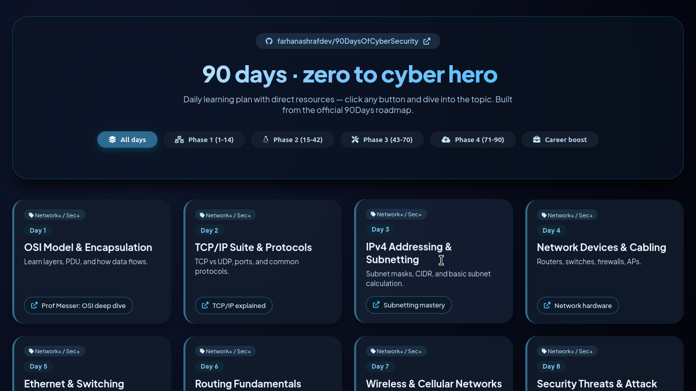

# 🛡️ 90 Days of Cyber Security – Interactive Roadmap




An interactive, day-by-day learning plan designed for aspiring cybersecurity professionals. This project provides a structured roadmap with curated, high-quality free resources (videos, tutorials, labs) to guide you from foundational concepts to career readiness.

Built upon the original [90DaysOfCyberSecurity](https://github.com/farhanashrafdev/90DaysOfCyberSecurity) curriculum.

---

## 📌 Table of Contents

* [🚀 Features](#-features)
* [📁 Project Structure](#-project-structure)
* [🔧 Installation](#-installation)
* [▶️ Usage](#️-usage)
* [📅 Phases Overview](#-phases-overview)
* [🧰 Technologies Used](#-technologies-used)
* [📚 Learning Approach](#-learning-approach)
* [🛠️ Customization](#️-customization)
* [🐛 Troubleshooting](#-troubleshooting)
* [🌟 Credits](#-credits)
* [🤝 Contributors](#-contributors)
* [📄 License](#-license)

---

## 🚀 Features

* 📆 **95 days of structured learning** (90 core + 5 career-focused)
* 🔍 **Phase-based filtering system** for targeted study
* 🔗 **Direct access to curated resources** (one click learning)
* 💎 **Modern responsive UI** with glassmorphism design
* ⚡ **Lightweight & fast** – no frameworks or dependencies
* 📱 **Mobile-friendly experience**

---

## 📁 Project Structure

```
.
├── index.html   # Main application interface
├── styles.css   # UI styling and layout
├── script.js    # Learning data + filtering logic
└── README.md    # Project documentation
```

---

## 🔧 Installation

1. **Clone the repository**

   ```bash
   git clone https://github.com/MOUKA-513/90DaysOfCyberSecurity-Interactive.git
   ```

2. **Navigate into the project directory**

   ```bash
   cd 90DaysOfCyberSecurity-Interactive
   ```

3. **Open the project**

   * Simply open `index.html` in your browser

> No build tools, package managers, or servers required.

---

## ▶️ Usage

* Open `index.html` in any modern browser
* Use the **phase filters** to focus on specific learning stages
* Click on any **resource link** to begin that day’s lesson
* Progress sequentially or jump between topics as needed

---

## 📅 Phases Overview

| Phase   | Days  | Focus Area                            |
| ------- | ----- | ------------------------------------- |
| Phase 1 | 1–14  | Network+ & Security+ fundamentals     |
| Phase 2 | 15–42 | Linux command line & Python scripting |
| Phase 3 | 43–70 | Traffic analysis, Git, ELK Stack      |
| Phase 4 | 71–90 | Cloud security & ethical hacking      |
| Phase 5 | 91–95 | Career prep & job readiness           |

---

## 🧰 Technologies Used

* **HTML5** – Structure
* **CSS3** – Styling & animations (glassmorphism UI)
* **JavaScript (Vanilla)** – Logic & interactivity
* **Font Awesome** – Icons
* **Plus Jakarta Sans** – Typography

---

## 📚 Learning Approach

This roadmap follows a **progressive, hands-on learning strategy**:

* Start with **fundamentals** (networking & security basics)
* Build practical skills with **Linux & Python**
* Transition into **real-world tools** (ELK, Git, traffic analysis)
* Explore **advanced domains** (cloud security & penetration testing)
* Finish with **career-focused preparation**

---

## 🛠️ Customization

You can easily modify the roadmap:

* Edit `script.js` to:

  * Add or remove days
  * Update learning resources
  * Adjust phase categorization

* Modify `styles.css` to:

  * Change themes/colors
  * Customize layout and animations

---

## 🐛 Troubleshooting

**Issue:** Page not loading properly

* Ensure all files are in the same directory

**Issue:** Links not working

* Verify URLs inside `script.js`

**Issue:** Styling issues

* Check browser compatibility (use a modern browser)

---

## 🌟 Credits

* Original curriculum by [farhanashrafdev](https://github.com/farhanashrafdev)
* Icons by [Font Awesome](https://fontawesome.com/)
* Font: Plus Jakarta Sans

---

## 🤝 Contributors

Contributions are welcome!

If you'd like to improve this project:

1. Fork the repository
2. Create a new branch
3. Make your changes
4. Submit a pull request

---

## 📄 License

This project is licensed under the **MIT License**.

You are free to use, modify, and distribute this project with proper attribution.

---

## ⭐ Support

If you found this project helpful, consider giving it a **star ⭐** on GitHub — it helps others discover it!
## 📬 Connect with Me

[](https://github.com/MOUKA-513)
[](https://x.com/m0ukaa513)
[](https://instagram.com/mouka.513)

